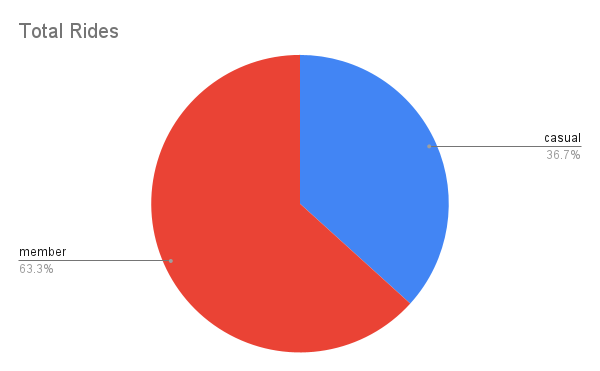

Course [link]( https://www.coursera.org/professional-certificates/google-data-analytics):
# Case_Study_Cyclist
Course: Google Data Analytics Capstone: Complete a Case Study
## Introduction
In this case study, I work for a fictional company, Cyclistic, along with some key team members. To answer the
business questions. My data analysis steps are: Ask, Prepare, Process, Analyze, Share, and Act.
## Scenario
I'm a junior data analyst working on the marketing analyst team at Cyclistic, a bike-share
company in Chicago. The marketing director believes the company’s future success
depends on maximizing the number of annual memberships. Therefore, my team wants to
understand how casual riders and annual members use Cyclistic bikes differently. From these
insights, my team will design a new marketing strategy to convert casual riders into annual
members. But first, Cyclistic executives must approve your recommendations, so they must be
backed up with compelling data insights and professional data visualizations.
### Characters and teams
● Cyclistic: A bike-share program that features more than 5,800 bicycles and 600
docking stations. Cyclistic sets itself apart by also offering reclining bikes, hand
tricycles, and cargo bikes, making bike-share more inclusive to people with disabilities
and riders who can’t use a standard two-wheeled bike. The majority of riders opt for
traditional bikes; about 8% of riders use the assistive options. Cyclistic users are more
likely to ride for leisure, but about 30% use the bikes to commute to work each day.
● Lily Moreno: The director of marketing and your manager. Moreno is responsible for
the development of campaigns and initiatives to promote the bike-share program.
These may include email, social media, and other channels.
● Cyclistic marketing analytics team: A team of data analysts who are responsible for
collecting, analyzing, and reporting data that helps guide Cyclistic marketing strategy.
You joined this team six months ago and have been busy learning about Cyclistic’s
mission and business goals—as well as how you, as a junior data analyst, can help
Cyclistic achieve them.
● Cyclistic executive team: The notoriously detail-oriented executive team will decide
whether to approve the recommended marketing program.
# Ask
Three questions will guide the future marketing program:
1. How do annual members and casual riders use Cyclistic bikes differently?
2. Why would casual riders buy Cyclistic annual memberships?
3. How can Cyclistic use digital media to influence casual riders to become members?
Moreno has assigned you the first question to answer: How do annual members and casual
riders use Cyclistic bikes differently?
# Prepare
I used Cyclistic’s historical trip data to analyze and identify trends. Download the previous 12
months of Cyclistic trip data [here]([url](https://divvy-tripdata.s3.amazonaws.com/index.html)). (Note: The datasets have a different name because Cyclistic
is a fictional company. For the purposes of this case study, the datasets are appropriate and
will enable me to answer the business questions. The data has been made available by
Motivate International Inc. under this [license]([url](https://divvybikes.com/data-license-agreement)).) This is public data that can be used to explore
how different customer types are using Cyclistic bikes.
# Analyze & Share
1. Prepare the Data:

I ensured consistency in columns, and where necessary, combine them into a single worksheet.
Then Cleaned and transform the data to make it ready for analysis.

2. Conduct Descriptive Analysis:

Run calculations to get a better sense of the data layout. For example:
Calculate the ride_length and day_of_week.

3. Create a Pivot Table for Quick Insights:

Calculate the average ride_length for members vs. casual riders:
Set rows = member_casual, and Values = Average of ride_length.
Analyze average ride_length by day of the week:
Use columns = day_of_week, rows = member_casual, and Values = Average of ride_length.
Count the number of rides by day of the week:
Add Count of trip_id to Values.

4. Explore Seasonal Data:

Open another file and repeat the descriptive analysis steps for data from different seasons.
Make some initial observations about how trends change over time.
Merge Data for a Full-Year View:

Once I’ve worked with the individual spreadsheets, I merge them into a comprehensive full-year dataset.
I use the chosen analysis tool for this—whether it’s a spreadsheet, a database with SQL, or R Studio.

5.Export a Summary File:

After finalizing my analysis, I export a summary file for further exploration or reporting.

# Share
First I analyze total rides by casual & members

